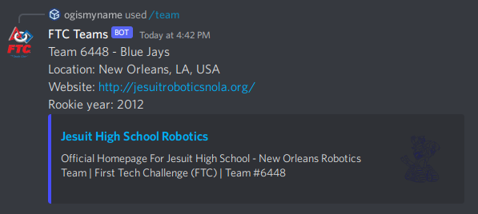
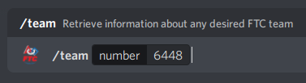

# ftc-bot
Retrieve information about a First Tech Challenge team in Discord

## How it works
The bot pulls information from the First Tech Challenge API about the team number you enter.

## Setup
1. Sign up for a First Tech Challenge API key using [this link](https://ftc-events.firstinspires.org/services/API).
2. Create a Discord application and bot using [this link](https://discord.com/developers/applications).
3. Create two files within the main folder of the bot: `botToken` and `ftcCredentials`.
4. Paste your FTC API credentials in the `ftcCredentials` file. Use the format `username:[API key]`.
5. Paste your Discord token in the `botToken` file.
6. Run the `main.py` file.

## Usage
This bot is very simple, only using one command: `/team`. Enter `/team` and a team number when prompted.


## Sample Output
```
Team 6448 - Blue Jays
Location: New Orleans, LA, USA
Website: http://jesuitroboticsnola.org/
Rookie year: 2012
```
